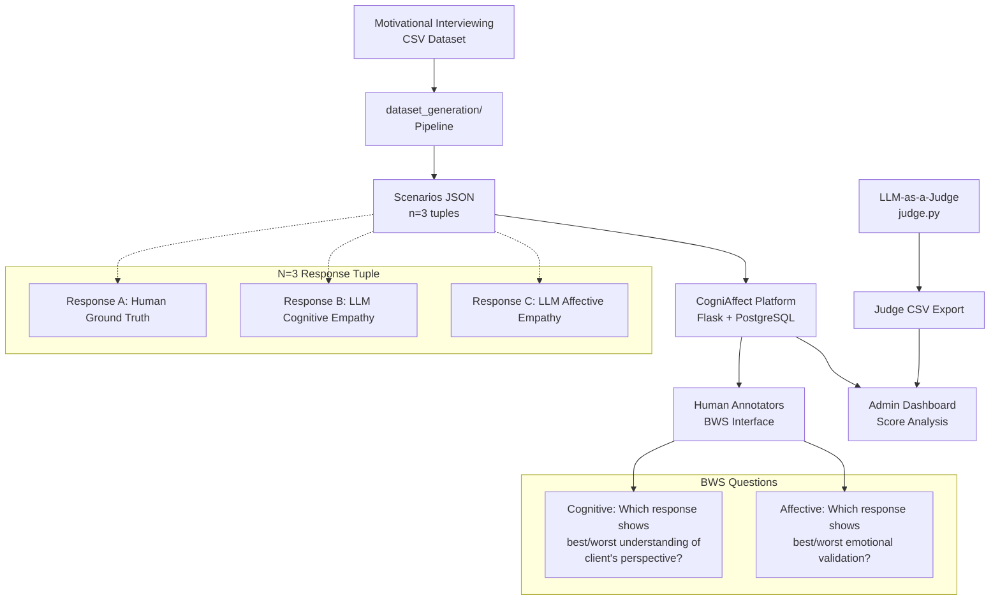

# CogniAffect — BWS Empathy Annotation Platform

**A research platform for evaluating multi-dimensional empathy in therapeutic dialogues using Best-Worst Scaling (BWS), comparing human annotators to LLM-as-a-judge.**

This codebase supports a **McMaster University Directed Readings** research study investigating whether automated BWS annotation can effectively assess cognitive and affective empathy in therapeutic responses, and whether BWS reduces bias where LLMs over-index on explicit emotional language versus implicit understanding. The platform enables reproducible collection of human BWS annotations, parallel LLM-as-a-judge evaluation, and comprehensive comparison analysis.

**Live Deployment**: [cogniaffect.onrender.com](https://cogniaffect.onrender.com/)  
**Admin Dashboard**: [cogniaffect.onrender.com/admin](https://cogniaffect.onrender.com/admin)

---

## Research Context

This codebase implements the methodology described in our project proposal and supports the findings presented in our ACL-format research paper. The study addresses two key research questions:

1. **Can automated BWS (LLM-as-a-judge) effectively rank therapeutic dialogue responses for cognitive and affective empathy when compared to a human baseline?**
2. **Does BWS reduce bias where LLMs over-index on explicit emotional language versus genuine cognitive understanding?**

### Study Design

- **Dataset**: Motivational Interviewing conversations from therapeutic settings (Welivita & Pu, 2022)
- **Methodology**: Best-Worst Scaling with n=3 tuples per scenario
- **Statistical Power**: 64 transcripts required (α=0.05, power=0.8, medium effect size=0.5)
- **Empathy Dimensions**: Cognitive empathy (perspective-taking, mental state inference) vs Affective empathy (emotional validation, warmth)

### Three Deliverables

1. **Interactive Annotation Platform** (this codebase) — web-based BWS collection with session management
2. **Reproducible Analysis Pipeline** — data preparation, LLM generation, scoring, and comparison scripts
3. **Research Paper** — ACL-format analysis of human vs LLM empathy assessment capabilities

---

## How It Works



### Annotation Process

1. **Data Preparation**: Raw therapeutic conversations are filtered, sanitized, and sampled into 64 scenarios
2. **Response Generation**: Each scenario contains:
   - **Response A**: Original human counselor reply (ground truth)
   - **Response B**: LLM-generated cognitive empathy response (using specialized prompts)
   - **Response C**: LLM-generated affective empathy response (using specialized prompts)
3. **Human Annotation**: Annotators see shuffled, anonymized responses and select best/worst for both empathy dimensions
4. **LLM Evaluation**: Parallel machine annotation using the same BWS task and scoring
5. **Analysis**: BWS scores computed using Kiritchenko & Mohammad (2016) methodology, with human-LLM comparison

---

## Live Deployment

### For Annotators: [cogniaffect.onrender.com](https://cogniaffect.onrender.com/)

1. **Enter Annotator ID** (or use auto-generated ID like `ANNO_042`)
2. **Read therapeutic dialogue context** — multi-turn conversation between client and therapist
3. **Review three response options** (A, B, C) — anonymized, randomly ordered
4. **Complete BWS questions**:
   - **Cognitive Empathy**: Which response best/least shows understanding of the client's perspective and situation?
   - **Affective Empathy**: Which response best/least validates the client's emotional experience?
5. **Optional reasoning** — free-text explanation for each choice
6. **Navigate freely** — sidebar shows progress, skip and return to any scenario
7. **Session persistence** — annotations auto-save every 30 seconds, resume with same ID

### For Researchers: [cogniaffect.onrender.com/admin](https://cogniaffect.onrender.com/admin)

**Three main tabs:**

1. **Human Annotations Tab**
   - Upload new scenario sets (replaces data and deletes all annotations)
   - View annotator progress and completion statistics
   - Download CSV exports of all annotations
   - Real-time BWS score calculation and visualization
   - Per-scenario breakdown with heatmaps

2. **LLM-as-a-Judge Tab**
   - Upload LLM judge CSV files (same format as human export)
   - View uploaded judge models and completion stats
   - Generate BWS scores for selected judge models
   - Per-scenario analysis for LLM judgments

3. **Comparison Tab**
   - Side-by-side human vs LLM score comparison
   - Overall score differences (human - LLM)
   - Per-scenario mean absolute error (MAE) analysis
   - Correlation analysis (Pearson r)
   - Identify scenarios with largest disagreements

---

## Project Structure

```
Directed Readings BWS Annotation/
├── server.py                    # Flask backend — APIs, database, admin dashboard
├── pyproject.toml               # Poetry dependencies (Flask, OpenAI, PostgreSQL)
├── requirements.txt             # Pip fallback dependency list
├── prompts.py                   # LLM prompt templates (cognitive vs affective)
├── migrate_sqlite_to_postgres.py # Legacy DB migration script
├── pdf_cleaner.py               # Unstructured PDF text extraction utility
│
├── Power Analysis/
│   └── power.py                    # Statistical power analysis (64 transcripts needed)
│
├── dataset_generation/          # Data pipeline from CSV to scenarios JSON
│   ├── README.md                   # Full pipeline documentation
│   ├── text_sanitize.py            # Unicode/HTML/mojibake cleanup
│   ├── build_transcript_set.py     # Sample & filter to 64 conversations
│   ├── export_scenarios_from_shortlist.py # CSV → CogniAffect JSON format
│   ├── generate_llm_candidate_responses.py # Fill Response B/C via OpenAI
│   ├── full_dataset_rows.csv       # Source pool (MI conversations)
│   └── outputs/
│       ├── transcript_set.csv      # Sampled 64 conversations
│       ├── transcript_set_build.log # Build log (exclusions, seed, etc.)
│       ├── scenarios_transcript_set.json # App-ready format
│       └── scenarios_transcript_set_with_llm.json # After LLM generation
│
├── LLM-as-a-judge/              # Parallel machine annotation
│   ├── README.md                   # Judge script documentation & prompt design
│   ├── judge.py                    # OpenAI BWS annotation script
│   └── output/                     # Timestamped CSV exports
│       └── llm_judge_*.csv         # Results by model (GPT-4, GPT-5, etc.)
│
├── scenario_datasets/           # Archived model-generated bundles
│   ├── gp5-generated-responses.json
│   ├── gpt-4o.json
│   └── gpt-5-mini.json
│
├── frontend/                    # React + Vite SPA
│   ├── src/
│   │   ├── views/                  # WelcomeScreen, AnnotationView, CompletionScreen
│   │   ├── components/             # UI primitives, layout components
│   │   ├── features/annotation/    # BWS question components
│   │   ├── hooks/                  # useAnnotationSession, useAutoSync
│   │   ├── state/                  # Reducer, actions, initial state
│   │   └── utils/                  # API client, localStorage, CSV generation
│   ├── package.json               # React 19, Vite 8, Tailwind
│   └── vite.config.js             # Build → ../dist/, dev proxy to Flask
│
├── dist/                       # Vite production build (served by Flask)
│   ├── index.html
│   └── assets/
│
├── annotations.db              # SQLite (legacy, gitignored)
├── generate-BWS-tuples.pl      # Kiritchenko & Mohammad reference (Perl)
├── get-scores-from-BWS-annotations-counting.pl # BWS scoring (Perl)
├── main_scenarios.json         # Active scenario set
├── scenarios*.json             # Scenario variants
└── sample_output.csv           # Example export format
```

### Key Files Explained

- **`server.py`**: Main Flask application with PostgreSQL backend, serves React SPA, provides REST APIs for annotation sync, admin management, BWS scoring, and LLM-judge comparison
- **`prompts.py`**: Contains `COGNITIVE_PROMPT` and `EMOTIONAL_PROMPT` templates used by `generate_llm_candidate_responses.py` to create Response B and C
- **`dataset_generation/`**: Complete pipeline to transform raw therapeutic conversation CSV into annotation-ready scenarios with LLM-generated responses
- **`LLM-as-a-judge/judge.py`**: Standalone script that replicates human BWS task using OpenAI models, outputs CSV in same format as human annotations for direct comparison
- **`Power Analysis/power.py`**: Computes required sample size using statsmodels (64 transcripts for α=0.05, power=0.8, effect size=0.5)

---

## Running Locally

### Prerequisites

- **Python 3.11+**
- **Node.js 18+** and **npm**
- **Poetry** (recommended) — install with: `curl -sSL https://install.python-poetry.org | python3 -`
- **PostgreSQL database** (local or hosted like Supabase)

### Setup Steps

1. **Clone the repository**
   ```bash
   git clone <repository-url>
   cd "Directed Readings BWS Annotation"
   ```

2. **Configure environment**
   ```bash
   cp .env.example .env
   # Edit .env with your values:
   # OPENAI_API_KEY=sk-...
   # DATABASE_URL=postgresql://...
   # ADMIN_SECRET=your-secret-key
   ```

3. **Install Python dependencies**
   ```bash
   poetry install
   ```

4. **Build the frontend**
   ```bash
   cd frontend
   npm install
   npm run build
   cd ..
   ```

5. **Start the server**
   ```bash
   poetry run python server.py
   ```

6. **Access the application**
   - **Annotators**: http://localhost:5000
   - **Admin**: http://localhost:5000/admin
   - **API docs**: http://localhost:5000/api/status

### Development Mode

For frontend development with hot reload:

```bash
# Terminal 1: Flask backend
poetry run python server.py

# Terminal 2: Vite dev server
cd frontend
npm run dev  # Opens http://localhost:5173 with proxy to Flask
```

---

## Reproducing the Study (End-to-End Pipeline)

### 1. Data Preparation

```bash
# Build transcript set (64 conversations from source CSV)
poetry run python dataset_generation/build_transcript_set.py

# Export to CogniAffect JSON format
poetry run python dataset_generation/export_scenarios_from_shortlist.py

# Generate LLM candidate responses (requires OPENAI_API_KEY)
poetry run python dataset_generation/generate_llm_candidate_responses.py
```

Output: `dataset_generation/outputs/scenarios_transcript_set_with_llm.json`

### 2. Platform Setup

```bash
# Start the server
poetry run python server.py

# Upload scenarios via admin (requires ADMIN_SECRET)
# Visit http://localhost:5000/admin
# Upload the scenarios JSON file in the "Active scenario set" section
```

### 3. Human Annotation Collection

1. Share annotator link: http://localhost:5000
2. Annotators complete BWS tasks for all 64 scenarios
3. Monitor progress via admin dashboard
4. Export completed annotations: http://localhost:5000/api/export/csv

### 4. LLM-as-a-Judge Evaluation

```bash
# Run judge on the same scenarios
poetry run python LLM-as-a-judge/judge.py \
  --scenarios dataset_generation/outputs/scenarios_transcript_set_with_llm.json \
  --model gpt-4o \
  --annotator-id GPT-4O-JUDGE

# Output: LLM-as-a-judge/output/llm_judge_GPT-4O-JUDGE_*.csv
```

### 5. Comparison Analysis

1. Upload LLM judge CSV via admin dashboard (LLM-as-a-Judge tab)
2. Use Comparison tab to analyze human vs LLM differences
3. Export comparison data for statistical analysis

### 6. Statistical Testing

Use exported CSVs with your preferred analysis tools (R, Python pandas) to perform:
- Two-tailed paired t-tests comparing BWS scores
- Effect size calculations
- Qualitative analysis of disagreement cases

---

## Annotator Workflow

1. **Enter ID**: Provide an annotator ID (or leave blank for auto-generated like `ANNO_042`)
2. **Read context**: Review the therapeutic dialogue between client and therapist
3. **Evaluate responses**: Three anonymized responses (A, B, C) are shown in randomized order
4. **BWS annotation**: For each empathy dimension, select:
   - **Most**: Which response is BEST at showing that type of empathy?
   - **Least**: Which response is WORST at showing that type of empathy?
5. **Optional reasoning**: Explain your choices in free-text fields
6. **Navigate**: Use sidebar to jump between scenarios, track progress
7. **Auto-save**: Annotations sync every 30 seconds; resume with same ID

**Session Status**: Header shows sync status (Server synced, Syncing..., Local only)

---

## Researcher / Admin Workflow

### Human Annotations Management

1. **Upload scenarios**: Replace active scenario set (deletes all existing annotations)
2. **Monitor progress**: View annotator completion statistics in real-time
3. **Export data**: Download CSV files (all annotators or individual)
4. **Analyze scores**: View BWS scores with interactive visualizations

### LLM-as-a-Judge Integration

1. **Run judge script**: Generate machine annotations using `judge.py`
2. **Upload results**: Import LLM judge CSV files via admin interface
3. **Compare models**: Switch between different LLM judges (GPT-4, GPT-5, etc.)
4. **Delete datasets**: Remove LLM judge data for specific models

### Human vs LLM Comparison

1. **Select judge model**: Choose which LLM judge to compare against humans
2. **View summary**: Mean absolute differences, correlation coefficients
3. **Scenario analysis**: Identify cases with largest human-LLM disagreements
4. **Export insights**: Use comparison data for qualitative error analysis

---

## Environment Variables

| Variable | Required | Description |
|----------|----------|-------------|
| `OPENAI_API_KEY` | Yes | OpenAI API key for LLM response generation and judging |
| `DATABASE_URL` | Yes | PostgreSQL connection string (append `?sslmode=require` for hosted DBs) |
| `ADMIN_SECRET` | Yes | Authentication key for admin dashboard and scenario uploads |
| `CORS_ORIGINS` | No | Comma-separated allowed origins for frontend (default: GitHub Pages + common dev servers) |
| `DB_POOL_MAX` | No | PostgreSQL connection pool size (default: 4) |
| `PORT` | No | Server port (default: 5000) |

Copy `.env.example` to `.env` and fill in your values. Never commit `.env` to version control.

---

## API Endpoints

| Endpoint | Method | Description |
|----------|--------|-------------|
| `/` | GET | Serves the annotation app (React SPA) |
| `/scenarios.json` | GET | Active scenario set JSON |
| `/admin` | GET | Admin dashboard (embedded HTML/JS) |
| **Session Management** |
| `/api/session/<id>` | GET | Retrieve saved session by annotator ID |
| `/api/session/<id>` | DELETE | Delete session |
| `/api/sync` | POST | Upsert annotations and session data |
| **Export & Analysis** |
| `/api/export/csv` | GET | Download all annotations (CSV) |
| `/api/export/csv/<id>` | GET | Download one annotator's data (CSV) |
| `/api/scores` | GET | Human BWS scores (JSON) |
| `/api/annotators` | GET | Annotator statistics |
| `/api/status` | GET | Database summary |
| **Admin (requires ADMIN_SECRET)** |
| `/api/admin/scenarios` | GET | Scenario set metadata |
| `/api/admin/scenarios` | POST | Upload new scenario set (deletes all existing data) |
| **LLM-as-a-Judge** |
| `/api/llm-judge/models` | GET | List uploaded judge models |
| `/api/llm-judge/upload` | POST | Upload LLM judge CSV |
| `/api/llm-judge/scores` | GET | LLM BWS scores for model |
| `/api/llm-judge/delete` | POST | Delete LLM judge data |
| `/api/comparison` | GET | Human vs LLM comparison analysis |

---

## CSV Output Format

Both human annotations and LLM judge exports use identical 15-column format:

| Column | Description |
|--------|-------------|
| `annotation_id` | Unique ID: `{annotator_id}_S{scenario_number}` |
| `annotator_id` | Human ID or LLM model name |
| `scenario_id` | Scenario identifier (e.g., `SCENARIO_01`) |
| `context_snippet` | First 100 chars of dialogue context |
| `response_a_label`, `response_b_label`, `response_c_label` | Ground truth labels after shuffle |
| `cognitive_most`, `cognitive_least` | Selected responses (A/B/C) for cognitive empathy |
| `cognitive_reasoning` | Optional explanation text |
| `affective_most`, `affective_least` | Selected responses (A/B/C) for affective empathy |
| `affective_reasoning` | Optional explanation text |
| `timestamp` | ISO 8601 completion time |
| `session_duration_seconds` | Time spent on scenario |

**Unblinding**: To map display letters (A/B/C) back to conditions (`HUMAN`, `LLM_COGNITIVE`, `LLM_AFFECTIVE`), use the `response_*_label` columns which account for per-annotator randomization.

---

## Scenarios JSON Format

```json
{
  "annotator_id": null,
  "import_timestamp": "2024-01-01T00:00:00Z",
  "scenarios": [
    {
      "scenario_id": "SCENARIO_01",
      "context": "Client: I've been feeling overwhelmed...\n\nTherapist: ...",
      "responses": [
        { "response_id": "A", "text": "Human counselor response..." },
        { "response_id": "B", "text": "LLM cognitive empathy response..." },
        { "response_id": "C", "text": "LLM affective empathy response..." }
      ],
      "ground_truth_labels": {
        "A": "HUMAN",
        "B": "LLM_COGNITIVE", 
        "C": "LLM_AFFECTIVE"
      },
      "source_dialog_id": "MI_001",
      "source_row_index": 42
    }
  ]
}
```

Response order is randomized per annotator during presentation. Ground truth labels enable analysis after unblinding.

---

## BWS Scoring Methodology

BWS scores are computed using the **Kiritchenko & Mohammad (2016, 2017) counting method**, implemented in Python (ported from the included Perl scripts):

**Formula**: `Score = (times_chosen_best - times_chosen_worst) / times_appeared`

**Algorithm**:
1. For each completed annotation, count item appearances and selections
2. Aggregate across all annotators for each response type
3. Compute relative scores (range: -1 to +1)
4. Higher scores indicate better empathy for that dimension

**Per-scenario analysis**: BWS scores are also computed within individual scenarios to identify specific cases where human and LLM judgments diverge most strongly.

**Statistical comparison**: Exported CSV data enables t-tests, effect size calculations, and correlation analysis between human and machine annotations.

---

## Deployment on Render

The live deployment uses a two-service architecture:

### Web Service (Backend)
- **Repository**: Auto-deploys from main branch
- **Build**: `poetry install`
- **Start**: `poetry run python server.py`
- **Environment**: Set `DATABASE_URL`, `OPENAI_API_KEY`, `ADMIN_SECRET`

### Static Site (Frontend) 
- **Build**: `cd frontend && npm ci && npm run build`
- **Publish**: `dist/`
- **Environment**: `VITE_API_BASE=https://cogniaffect.onrender.com`

**CORS Configuration**: Set `CORS_ORIGINS` to include your static site domain.

**Cold Start**: Free tier services sleep after 15min idle. First request may take 30+ seconds.

---

## Technical Notes

- **Database**: PostgreSQL with connection pooling; automatic table creation on startup
- **Security**: Admin endpoints require `ADMIN_SECRET` bearer token authentication
- **Offline Resilience**: Frontend saves to localStorage when server unreachable, syncs when reconnected  
- **Session Management**: Idempotent sync API supports retries and partial uploads
- **Response Randomization**: A/B/C presentation order shuffled per annotator to prevent position bias
- **Data Integrity**: Scenario uploads validate JSON schema and delete conflicting data with confirmation

---

## Troubleshooting

| Issue | Solution |
|-------|---------|
| **"Local only" badge in header** | Server not reachable; check Flask is running and URL matches |
| **ModuleNotFoundError: flask** | Run `poetry install` or `pip install -r requirements.txt` |
| **poetry: command not found** | Install Poetry: `curl -sSL https://install.python-poetry.org \| python3 -` |
| **CSV garbled in Excel** | Use Data → From Text/CSV with UTF-8, or open in Google Sheets |
| **Database connection errors** | Verify `DATABASE_URL` format and network access; append `?sslmode=require` for hosted DBs |
| **Admin upload fails** | Check `ADMIN_SECRET` matches server environment; ensure JSON is valid scenarios format |
| **LLM generation errors** | Verify `OPENAI_API_KEY` is valid and has sufficient credits; check API rate limits |

---

## References

- Kiritchenko, S., & Mohammad, S. M. (2016). Capturing reliable fine-grained sentiment associations by crowdsourcing and best–worst scaling. *NAACL-HLT*.
- Kiritchenko, S., & Mohammad, S. M. (2017). Best-worst scaling more reliable than rating scales: A case study on sentiment intensity annotation. *ACL*.
- Lahnala, A., Welch, C., Jurgens, D., & Flek, L. (2022). A critical reflection and forward perspective on empathy and natural language processing. *EMNLP Findings*.
- Welivita, A., & Pu, P. (2022). Curating a large-scale motivational interviewing dataset using peer support forums. *COLING*.

---

*This platform was developed for McMaster University Directed Readings research investigating multi-dimensional empathy assessment in therapeutic AI systems. For questions about the research methodology or findings, please refer to the associated project proposal and ACL-format research paper.*
